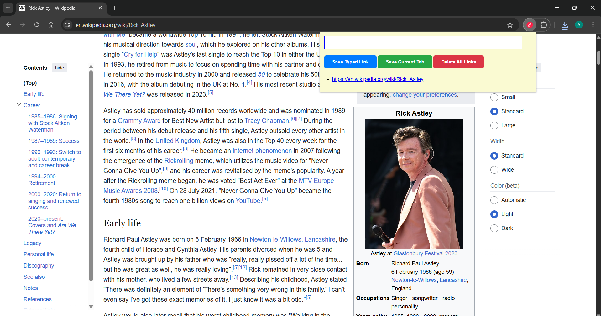

# 🔖 Link Saver Chrome Extension

Link Saver is a simple and efficient Chrome extension that lets users save and manage useful URLs. With a single click, you can store links from your browser tabs or add custom ones manually. Your saved links persist across sessions using `localStorage`.

## 🚀 Features

- **Save Typed Link**: Manually enter and save any URL.
- **Save Current Tab**: Instantly capture and store the URL of the currently active tab.
- **Delete All Links**: Double-click to remove all saved links.
- **Persistent Storage**: Saved links remain available between sessions using localStorage.
- **User-Friendly UI**: Clean layout with hover effects, button transitions, and responsive font sizes.

## 🖼️ Preview

 <!-- Replace with actual screenshot if available -->

## 🧠 Tech Stack

- **HTML/CSS/JavaScript**
- **Chrome Extensions API** (specifically `chrome.tabs`)
- **localStorage** for persistent data handling

## 🛠️ Installation (For Local Testing)

1. Clone the repository:
   ```bash
   git clone https://github.com/AryanPatel1918/link-saver-extension.git
2. Open Chrome and go to chrome://extensions/
3. Enable Developer Mode.
4. Click Load unpacked and select the project directory.

🧪 How to Use
- Type a URL into the input field and click Save Typed Link.
- Click Save Current Tab to store the current tab’s URL.
- Click Delete All Links twice (double-click) to remove all saved links.
- Click any listed link to open it in a new tab.
